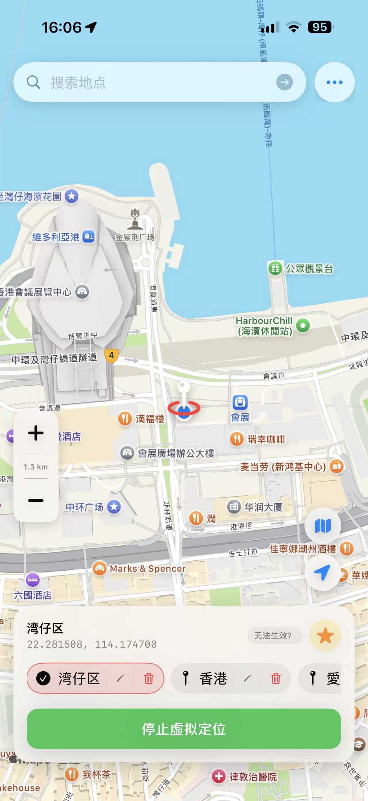
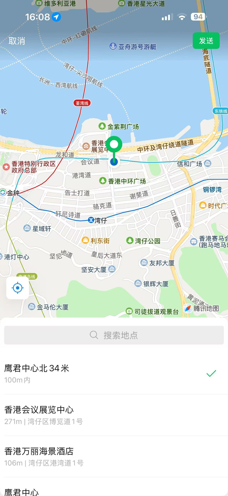
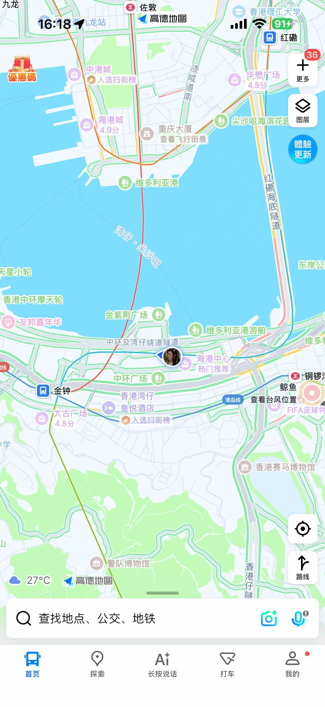
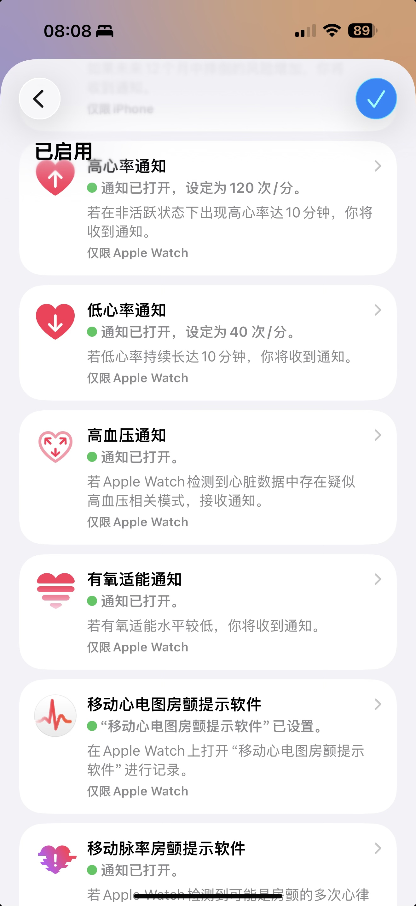

<div align="center">

# 📍 Location Spoofer

### iOS 虚拟定位 · 钉钉定位 · 微信定位 · Apple Watch 国区功能解锁 · Fake GPS

**无需 VPN、无需越狱，在 iPhone 本机通过 Wi‑Fi HTTP 代理改写 Apple 定位响应。**<br>
可修改钉钉、微信及任意依赖系统定位的 App 的位置。地图选点、实时位置、环境检测、证书配置与运行日志集中在一个 App 中。

[](project.yml)
[](project.yml)
[](Core/go.mod)
[](docs/CHANGELOG.md)
[](#为什么不需要-vpn)

[功能介绍](#核心功能) · [安装使用](#快速开始) · [English](README.en.md) · [更新日志](docs/CHANGELOG.md)



</div>

> [!IMPORTANT]
> 本项目用于学习、安全研究与自有设备测试。它会安装自签 CA，并在当前 Wi‑Fi 上配置本机 HTTP 代理。请先阅读工作原理和风险说明，并遵守当地法律、网络管理规则及相关服务条款。

## 致谢

核心定位响应改写思路与 Go 实现来源于 [Yu9191/wloc](https://github.com/Yu9191/wloc)。本项目在此基础上增加 SwiftUI 界面、MapKit 选点、证书与代理引导、环境验证、收藏和诊断能力。

## 为什么选择 Location Spoofer？

很多 iOS 虚拟定位工具依赖电脑常驻、开发者调试、VPN 或越狱。本项目采用不同路线：在 iPhone 本机运行 Go 代理，仅对 Apple 定位服务目标请求进行处理。

| 特性 | 说明 |
|---|---|
| 🚫 **无 VPN** | 不创建 VPN 隧道，仅使用定位权限，无需后台刷新、通知等额外权限 |
| 📱 **无需越狱** | 支持自行签名安装，最低部署目标为 iOS 15 |
| 🗺️ **原生地图体验** | 使用 Apple 地图同款蓝点，搜索、点击、拖动选点体验与 Apple 地图一致 |
| 📍 **系统级虚拟定位** | 支持钉钉、微信、Apple 地图、高德等 App 的虚拟实时定位 |
| 🔍 **可见缩放范围** | 左侧缩放控件显示当前可视范围，地点名称随级别自动适配 |
| 🧪 **环境检测** | 检查代理、CA 信任、Wi‑Fi 接管、坐标写入与响应改写 |
| 🧾 **诊断日志** | 每条日志独立可复制，方便整理和反馈问题 |

## 效果预览

<table>
  <tr>
    <th>应用主界面</th>
    <th>钉钉</th>
    <th>微信</th>
  </tr>
  <tr>
    <td></td>
    <td></td>
    <td></td>
  </tr>
  <tr>
    <th>Apple 地图</th>
    <th>高德地图</th>
    <th>Apple Watch</th>
  </tr>
  <tr>
    <td></td>
    <td></td>
    <td></td>
  </tr>
</table>

## 核心功能

- **iOS 虚拟定位 / Fake GPS**：将当前地图选点应用到本机定位响应改写代理，适配钉钉打卡、微信位置共享等场景。
- **原生实时位置**：地图显示 MapKit 自带蓝点，不再由 App 额外绘制实时位置标记。
- **并发安全选点**：拖动、点击、搜索、收藏和异步定位按用户最新意图处理，旧结果不会覆盖新选点。
- **地点名称分级**：近距离显示 POI、门牌或道路；拉远后显示社区、区县、城市或省份。
- **地图范围显示**：缩放控件中显示 `180 m`、`2.5 km`、`126 km` 等当前可视范围。
- **收藏与快速切换**：保存常用坐标，并明确显示当前准备应用的位置。
- **配置引导**：提供证书安装、完全信任、Wi‑Fi HTTP 代理、生效与恢复说明。
- **问题诊断**：内置验证流程和结构化运行日志。

## 快速开始

### 1. 安装 App

- 从 [Releases](https://github.com/xweiba/location-spoofer/releases) 获取构建产物并自行签名；或
- 在 macOS + Xcode 环境按[构建说明](docs/BUILD.md)编译。

详细步骤见[自签安装说明](docs/SELF-SIGNING.md)。

### 2. 安装并信任 CA

按首次引导下载描述文件，然后完成：

```text
设置 → 通用 → VPN 与设备管理 → 安装 WLOC CA
设置 → 通用 → 关于本机 → 证书信任设置 → 完全信任
```

### 3. 配置当前 Wi‑Fi 代理

在当前 Wi‑Fi 的"配置代理"中选择"手动"：

```text
服务器：127.0.0.1
端口：8888
鉴定：关闭
```

### 4. 选点并启用

1. 搜索、点击或拖动地图选择位置；点击实时位置按钮可回到 MapKit 蓝点。
2. 点击"开始虚拟定位"，等待环境检测通过。
3. 按 App 内"生效说明"刷新飞行模式、Wi‑Fi 和定位服务状态。
4. 打开 Apple 地图或目标 App 验证结果。

### 5. 恢复真实位置

停止虚拟定位，关闭当前 Wi‑Fi 的手动代理，并按 App 内"失效说明"刷新系统定位缓存。若系统仍保留旧缓存，请重启设备后再检查。

## 为什么不需要 VPN？

```text
iPhone 定位请求
      │ 当前 Wi‑Fi HTTP 代理：127.0.0.1:8888
      ▼
本机 wloccore（Go）
      │ 仅处理目标 Apple 定位服务请求
      ├──────────────► Apple 定位服务
      ◄──────────────┘
      │ 改写目标响应中的坐标
      ▼
系统与应用读取定位结果
```

项目不使用 Network Extension 创建 VPN 隧道，因此不会显示 VPN 连接，也不会占用系统 VPN。**但它仍需要为当前 Wi‑Fi 配置 HTTP 代理，并安装、信任本机生成的 CA。** 切换 Wi‑Fi 后需要重新检查代理设置；停止使用后应及时关闭手动代理。

## 兼容性

| 项目 | 要求 |
|---|---|
| iOS | 15.0+ |
| 构建 | macOS、Xcode、XcodeGen |
| Swift | 5.9 |
| Go | 1.23+ |
| 网络 | 可手动配置 HTTP 代理的 Wi‑Fi |
| 安装 | 自行签名或使用 Releases 构建产物 |

效果会受到 iOS 版本、网络、系统定位缓存和目标 App 自身策略影响，不承诺兼容所有系统或第三方 App。

## 构建与项目结构

```bash
./build.sh
```

构建产物默认位于：

```text
dist/PaopaoLocationSpoofer-unsigned.ipa
```

```text
App/        SwiftUI、MapKit、定位和配置流程
Core/       Go 本机代理与定位响应改写
Shared/     收藏、设置、日志和共享模型
Resources/  Info.plist、Entitlements 与图标
Scripts/    构建、签名和检查脚本
Tests/      XCTest 与 Bash 契约测试
docs/       构建、自签和版本更新文档
```

## 文档与反馈

- [构建说明](docs/BUILD.md)
- [自签安装](docs/SELF-SIGNING.md)
- [v1.0.0 更新日志](docs/CHANGELOG.md)
- [English README](README.en.md)
- [GitHub Issues](https://github.com/xweiba/location-spoofer/issues)

反馈问题时，请附上复现步骤、iOS 版本、设备型号及已脱敏的运行日志。

## 友链

**LinuxDo** — [https://linux.do](https://linux.do/)
